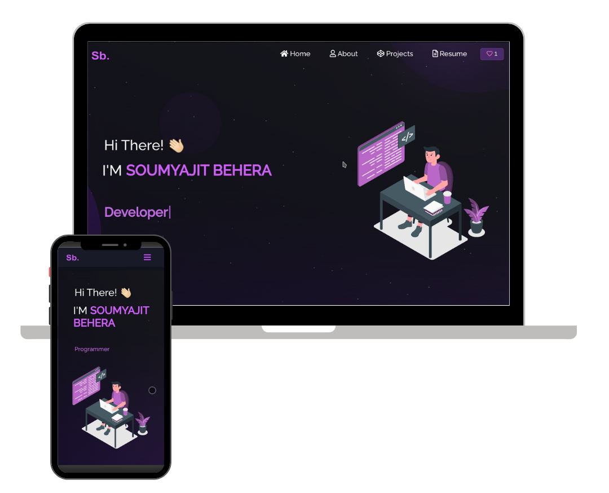

<h2 align="center">
  Syed Shayan Haider Portfolio - v1.0<br/>
  <a href="https://shayan-portfolio.vercel.app/" target="_blank">shayanhaider.tech</a>
</h2>

<div align="center">
  
</div>

<br/>

<center>

[](https://forthebadge.com) &nbsp;
[](https://forthebadge.com) &nbsp;
[](https://forthebadge.com) &nbsp;
 &nbsp;


</center>

<h3 align="center">
    🔹 <a href="https://github.com/shayanhaider/Portfolio/issues">Report a Bug</a> &nbsp; &nbsp;
    🔹 <a href="https://github.com/shayanhaider/Portfolio/issues">Request a Feature</a>
</h3>

---

## About

This is my personal portfolio website showcasing my skills, projects, and resume. It is built with modern web technologies and designed to be fully responsive. Feel free to explore it at [shayanhaider.tech](https://shayan-portfolio.vercel.app/).  

Original layout and idea inspired by [Soumyajit4419](https://github.com/soumyajit4419/Portfolio).

---

## Built With

- **React.js** – Frontend library for building UI  
- **Node.js & Express.js** – Backend for API handling  
- **CSS3 & React-Bootstrap** – Styling and responsive design  
- **VSCode** – Development environment  
- **Vercel** – Deployment platform  

---

## Features

- **📖 Multi-Page Layout** – Navigate between About, Skills, Projects, and Contact sections easily.  
- **🎨 Modern Styling** – Customizable colors and clean UI design.  
- **📱 Fully Responsive** – Works perfectly on mobile, tablet, and desktop.  

---

## Getting Started

### Prerequisites
Make sure you have `Node.js` and `Git` installed.

### Installation
1. Clone this repository:  
```bash
git clone https://github.com/shayanhaider/Portfolio.git

2.Navigate into the project folder:
cd Portfolio


3.Install dependencies:
npm install


4.Start the development server:
npm start


5.Open http://localhost:3000
 to view it in the browser. The page will reload if you make edits.

Usage:
All components are inside /src/components/.
You can edit your information, projects, and styling from there.
